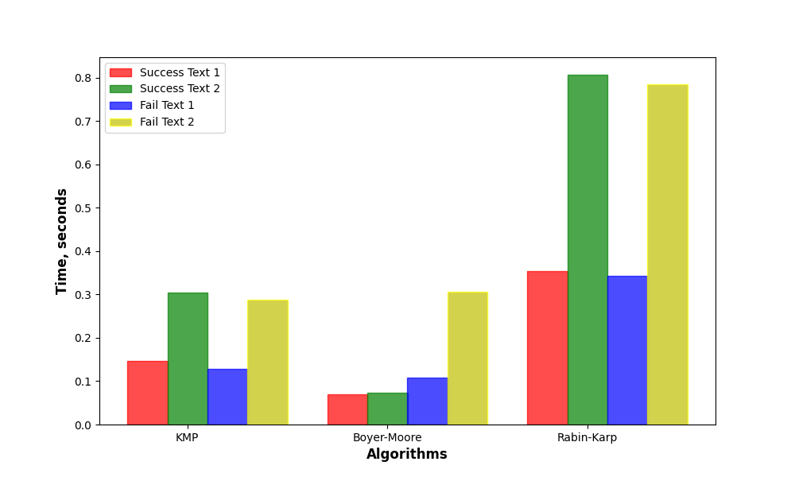

# goit-algo-hw-04

## Results:

The first **50** items from the list that is to be sorted: 

[
    9000000.0, 0.0, 9818181.818181818, 9727272.727272728, 1272727.2727272727, 4090909.090909091, 9272727.272727273, 6636363.636363637, 3454545.4545454546, 7909090.909090909, 6818181.818181818, 4181818.181818182, 5818181.818181818, 4272727.2727272725, 8363636.363636364, 3818181.8181818184, 6909090.909090909, 8636363.636363637, 2727272.7272727275, 4909090.909090909
]

### The time it took to sort the list of <ins>111</ins> random numbers is:

- 0.003 using sorting via `merging`;
- 0.0004 using sorting via `insertions`;
- 3.5599994589574635e-05 using sorting via the native python `sorted()` function.

### The time it took to sort the list of <ins>555</ins> random numbers is:

- 0.016 using sorting via `merging`;
- 0.006 using sorting via `insertions`;
- 0.0002 using sorting via the native python `sorted()` function.

### The time it took to sort the list of <ins>1111</ins> random numbers is:

- 0.03 using sorting via `merging`;
- 0.02 using sorting via `insertions`;
- 0.0003 using sorting via the native python `sorted()` function.

### The time it took to sort the list of <ins>5555</ins> random numbers is:

- 0.21 using sorting via `merging`;
- 0.57 using sorting via `insertions`;
- 0.0016 using sorting via the native python `sorted()` function.

### The time it took to sort the list of <ins>11111</ins> random numbers is:

- 0.4 using sorting via `merging`;
- 2.2 using sorting via `insertions`;
- 0.003 using sorting via the native python `sorted()` function.

### The time it took to sort the list of <ins>55555</ins> random numbers is:

- 2.6 using sorting via `merging`;
- 55.8 using sorting via `insertions`;
- 0.02 using sorting via the native python `sorted()` function.

### The time it took to sort the list of <ins>111111</ins> random numbers is:

- 5.7 using sorting via `merging`;
- 221.2 using sorting via `insertions`;
- 0.04 using sorting via the native python `sorted()` function.

### Visualize the results:

## Results:

As can be seen from the experiments and the graph representation of those, the inbuilt function `sorted()` is by far exceeds sorting via `insertions`, and is much faster than sorting via `merging`.